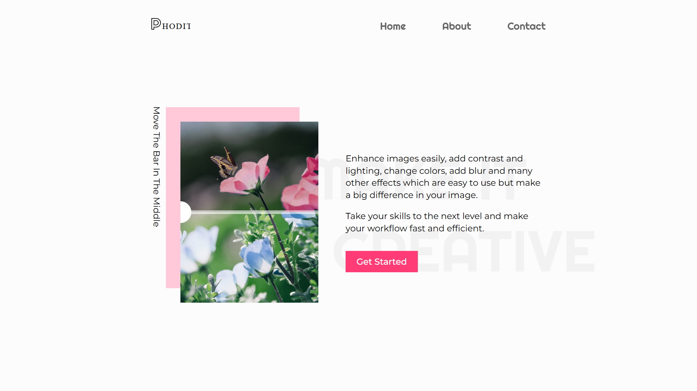

# Responsive Image Comparison Slider

[Live Demo](https://responsive-image-comparison-slider-nine.vercel.app) • This is an image comparison web application. I used HTML, Sass, Typescript and Webpack to build it and followed a mobile first, component base methodology for development. You can move the bar in between the images to see before and after versions. Touch base gesture interactions also works for small screens and mobile devices. I implemented a responsive navbar with a hamburger menu for the mobile version as well.

## Screenshots

